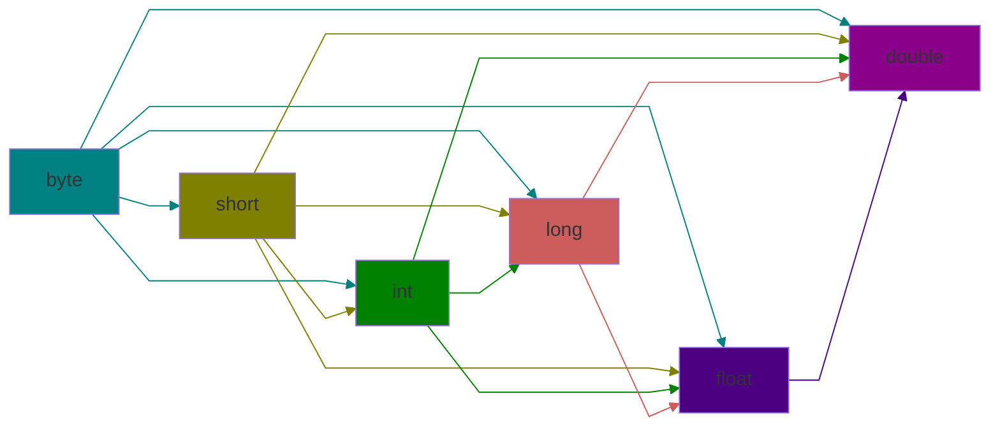

# משתנים
## פרימיטיביים
 - מספרים שלמים

| name  | size (bit) |
| ----- | ---------- |
| byte  | 8          |
| short | 16         |
| int   | 32         |
| long  | 64         |
 - מספרים ממשיים

| name   | size |
| ------ | ---- |
| float  | 32   |
| double | 64   |
 - תווים
	char - 16 bit
 - ערך בוליאני
	boolean - 1 bit
### קבועים
קבוע מגדירים באמצעות `final`:
```java
final int MIN_AGE = 16;
```
# ביטויים
## אריתמטיקה
 - אם פעולה מבוצעת על שני משתנים שלמים, התוצאה היא מספר שלם (הערך הממשי נאבד)
 - אם לפחות אחד משני המשתנים הוא ממשי, תוצאת הפעלה על המשתנים היא ממשית
 - כל פעולה אריתמטית מבוצעת על שני משתנים משמאל לימין לפי סדר פעולות החשבון (לשים לב מאיזה טיפוס המשתנים שעליהם מבוצעת הפעולה)
	 1. סוגריים, המרות
	 2. פעולות אונריות
	 3. כפל, חילוק, שארית
	 4. חיבור וחיסור
	 5. השמה
 - סדר פעולות אונריות:
```java
int a = 1, b = 1;

// prints 1
System.out.println(a++);

//prints 2
System.out.println(--b);
```
## המרות
```java
int a = 10;

// casting syntax
short b = (short)a;
double c = double(8);
```
### התאמה אוטומטית
במקרים מסוימים מתבצעת מתאמה אוטומטית בין טיפוס הערך לטיפוס המשתנה.

# מחלקות מובנות
## Scanner
עצירת התוכנית וקבלת מידע מהמשתמש.
```java
import java.util.Scanner;
...
Scanner scan = new Scanner(System.in);
int a = scan.nextInt();
```
## Math
אוסף פעולות מתמטיות.
```java
// power a^b
Math.pow(a, b);

// absolute value of a
Math.abs(a);

// square root of a
Math.sqrt(a);

// round a to nearest integer (float > int, double > long)
Math.round(a);

// Constatns
Math.PI;
Math.E;

// get max of two
Math.max(a, b);

// get min of two
Math.min(a, b);
```
# בקרת זרימה
 - תנאי גודל מספריים:
	 `>,<,>=,<=,==,!=`
 - תנאי `if` ו `else` ניתן לרשום עם ובלי סוגריים
 ```java
if (condition) {
	// multiple expressions
} else {
	// multiple expressions
}
//or
if (condition)
	// one expression
else
	// one expression
```
 - אופרטור טרנארי
`condition ? value if true : value else`
## תנאים מורכבים
 - `&&,||` - חישוב התנאי יתבצע עד להסקת ערך התנאי גם __בלי לבדוק את שאר התנאים__ (לדוגמה במקרה שהערך הראשון בתנאי `&&` הוא `false`)
 - `&,|` - חישוב כל התנאים בביטוי גם אם ערך התנאי ידוע
 - סדר חישוב התנאים משמאל לימין לפי סדר קדימויות:
	 1. שלילה `!`
	 2. וגם `&&,&`
	 3. או `||,|`
## `switch`
```java
int day; //user defiend

// stop after each case
switch (day) {
case 1:
	// expression
	break;
case "Sunday":
	// expression
	break;
default:
	// expression
}

// treat multiple cases with the same expression
switch (day) {
case 1:
case "Sunday":
	// expression
	break;
case 2:
case "Monday":
	// expression
	break;
}
```
# מחרוזת `String`
```java
// incorrect
String str = 6;

// correct
String str = "" + 6;
```
# השוואת נתונים
 - השוואה בין מספרים ממשיים לרמת דיוק מסויימת
```java
// desired precision 0.001
if (Math.abs(d1 - d2) < 0.001)
	// do something
```
 - השוואה בין תווים נעשית ע"י הערך המספרי שלהם ב unicode
 - השוואה בין מחרוזות
```java
// compare string s1 and s2
// if equal return true else false
s1.equals(s2)

// compare string s1 and s2 
// if equal return 0 if s1 is larger return >0 else return <0
s1.compareTo(s2)
```